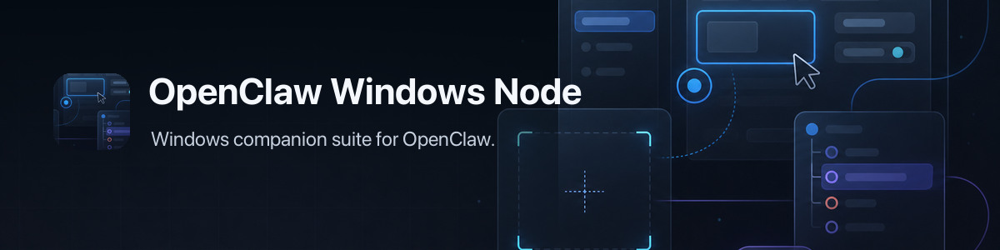
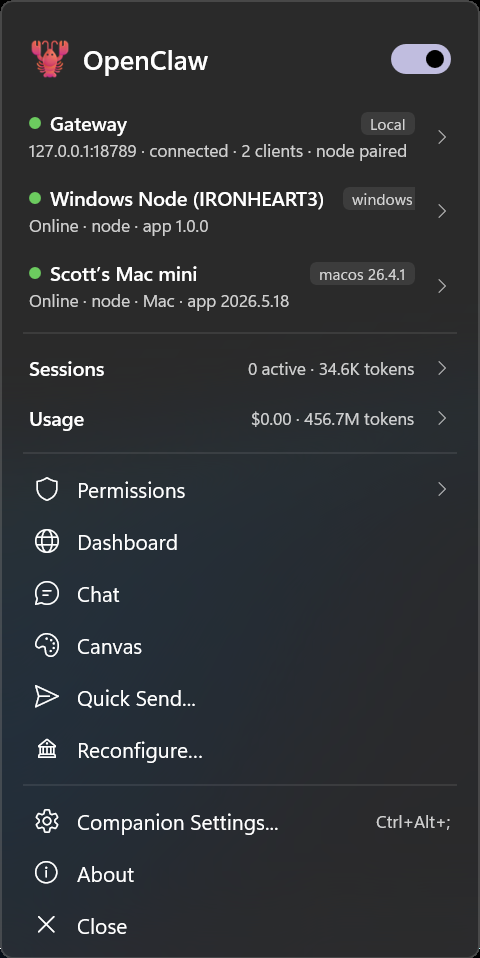
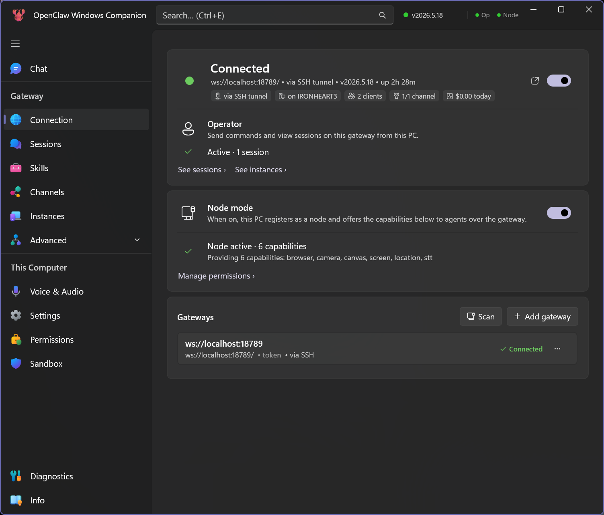

# 🦞 OpenClaw Windows Hub



A native Windows companion suite for [OpenClaw](https://openclaw.ai) - the AI-powered personal assistant.

*Made with 🦞 love by Scott Hanselman and Molty*






## Projects

This monorepo contains the Windows hub, shared client libraries, and CLI utilities:

| Project | Description |
|---------|-------------|
| **OpenClaw.Tray.WinUI** | System tray application (WinUI 3) for quick access to OpenClaw |
| **OpenClaw.Connection** | Gateway registry, credential resolution, and connection manager |
| **OpenClaw.Shared** | Shared gateway client library, capabilities, and MCP bridge |
| **OpenClaw.Chat** | Native chat model and timeline reducer |
| **OpenClaw.Cli** | CLI validator for WebSocket connect/send/probe using tray settings |
| **OpenClaw.WinNode.Cli** | `winnode` CLI for invoking local Windows node/MCP capabilities |
| **OpenClaw.SetupEngine** | Local gateway setup, WSL installation, and setup-code support |
| **OpenClaw.SetupEngine.UI** | WinUI setup wizard pages hosted by the tray app |
| **OpenClawTray.FunctionalUI** | In-repo declarative WinUI helper used by native chat and newer UI surfaces |

## 🚀 Quick Start

> **End-user installer?** Download the latest stable x64 or ARM64 installer from the [OpenClaw Windows docs](https://docs.openclaw.ai/platforms/windows), or see [docs/SETUP.md](docs/SETUP.md) for step-by-step installation (no build required).
>
> **Managed WSL gateway?** Local setup creates a locked-down app-owned `OpenClawGateway` distro. See [docs/WSL_GATEWAY_ADMIN.md](docs/WSL_GATEWAY_ADMIN.md) for editing `openclaw.json` as the `openclaw` user and using root for protected-file administration.
>
> **Operator or node?** Start with [Operator and node concepts](docs/OPERATOR_NODE_CONCEPTS.md) for the beginner-facing glossary of gateway, operator, node, pairing, reapproval, and allowlisted node capabilities.

Direct downloads from the latest OpenClaw Windows release:

- [OpenClawCompanion-Setup-x64.exe](https://github.com/openclaw/openclaw-windows-node/releases/latest/download/OpenClawCompanion-Setup-x64.exe)
- [OpenClawCompanion-Setup-arm64.exe](https://github.com/openclaw/openclaw-windows-node/releases/latest/download/OpenClawCompanion-Setup-arm64.exe)
- [OpenClawCompanion-SHA256SUMS.txt](https://github.com/openclaw/openclaw-windows-node/releases/latest/download/OpenClawCompanion-SHA256SUMS.txt)

### Prerequisites
- Windows 10 (20H2+) or Windows 11
- .NET 10.0 SDK - https://dotnet.microsoft.com/download/dotnet/10.0
- Node.js LTS with npm (for WinUI build assets)
- Windows 10 SDK (for WinUI build) - install via Visual Studio or standalone
- WebView2 Runtime - pre-installed on modern Windows, or get from https://developer.microsoft.com/microsoft-edge/webview2

### Developer / Agent Setup

Use the setup script to install or verify local Windows build prerequisites:

```powershell
# Install missing prerequisites with winget, trust the checkout, and verify setup
.\scripts\setup-dev.ps1

# Check only; do not install packages or change git safe.directory
.\scripts\setup-dev.ps1 -CheckOnly

# Install/verify prerequisites without adding the checkout to git safe.directory
.\scripts\setup-dev.ps1 -NoTrustRepository

# Setup and run the required build/test validation
.\scripts\setup-dev.ps1 -RunValidation
```

### Build

Use the build script to check prerequisites and build:

```powershell
# Check prerequisites
.\build.ps1 -CheckOnly

# Build all projects
.\build.ps1

# Build specific project
.\build.ps1 -Project WinUI
```

Or build directly with dotnet:

```powershell
# Build all (use build.ps1 for best results)
dotnet build

# Build WinUI (requires runtime identifier for WebView2 support)
dotnet build src/OpenClaw.Tray.WinUI/OpenClaw.Tray.WinUI.csproj -r win-arm64  # ARM64
dotnet build src/OpenClaw.Tray.WinUI/OpenClaw.Tray.WinUI.csproj -r win-x64    # x64

# Build MSIX package (for camera/mic consent prompts)
dotnet build src/OpenClaw.Tray.WinUI -r win-arm64 -p:PackageMsix=true  # ARM64 MSIX
dotnet build src/OpenClaw.Tray.WinUI -r win-x64 -p:PackageMsix=true    # x64 MSIX
```

### Run Tray App

```powershell
# Build and launch the unpackaged WinUI tray app
.\run-app-local.ps1

# If you already built, skip rebuild and launch the existing Debug output
.\run-app-local.ps1 -NoBuild

# Run isolated from your normal tray settings so multiple worktrees can run together
.\run-app-local.ps1 -Isolated

# Opt into side-by-side dev identity (separate mutex, protocol, gateway distro, and port)
.\run-app-local.ps1 -Dev -Isolated

# Alpha update testing from a Release build
.\run-app-local.ps1 -Configuration Release -Isolated -UpdateChannel alpha

# Optional: launch through WinAppCLI with Package.appxmanifest
.\run-app-local.ps1 -UseWinApp -NoBuild
```

The default path starts the unpackaged executable directly. `-UseWinApp` requires
Microsoft WinAppCLI (`winget install Microsoft.WinAppCLI`) and is only needed when
you want manifest/MSIX-adjacent launch validation.

### Run CLI WebSocket Validator

Use the CLI to validate gateway connectivity and `chat.send` outside the tray UI.

```powershell
# Show help
dotnet run --project src/OpenClaw.Cli -- --help

# Use tray settings from %APPDATA%\OpenClawTray\settings.json and send one message
dotnet run --project src/OpenClaw.Cli -- --message "quick send validation"

# Loop sends and also probe sessions/usage/nodes APIs
dotnet run --project src/OpenClaw.Cli -- --repeat 5 --delay-ms 1000 --probe-read --verbose

# Override gateway URL/token for isolated testing
dotnet run --project src/OpenClaw.Cli -- --url ws://127.0.0.1:18789 --token "<token>" --message "override test"
```

## 📦 OpenClaw.Tray (Molty)

Modern Windows 11-style system tray companion that connects to your local OpenClaw gateway.

### Features
- 🎨 **OpenClaw branding** - OpenClaw tray icon with status colors
- 🎨 **Modern UI** - Windows 11 flyout menu with dark/light mode support
- 💬 **Quick Send** - Send messages via global hotkey (Ctrl+Alt+Shift+C)
- 🔄 **Auto-updates** - Automatic updates from GitHub Releases
- 🌐 **Web Chat** - Embedded chat window with WebView2
- 📊 **Live Status** - Real-time sessions, channels, and usage display
- 🧭 **Command Center** - Dense gateway, channel, usage, node, pairing, and allowlist diagnostics from one window
- ⚡ **Activity Stream** - Command Center page for live session, usage, node, and notification events
- 🔔 **Toast Notifications** - Clickable Windows notifications with [smart categorization](docs/NOTIFICATION_CATEGORIZATION.md)
- 📡 **Channel Control** - Start/stop Telegram & WhatsApp from the menu
- 🖥️ **Node Observability** - Node inventory with online/offline state and copyable summary
- ⏱ **Cron Jobs** - Quick access to scheduled tasks
- 🚀 **Auto-start** - Launch with Windows
- ⚙️ **Settings** - Full configuration page
- 🎯 **First-run onboarding** — native WSL gateway setup with capability, permission, install, onboard, and completion screens

#### Quick Send scope requirement

Quick Send uses the gateway `chat.send` method and requires the operator device to have `operator.write` scope.

If Quick Send fails with `missing scope: operator.write`, Molty now copies identity + remediation guidance to your clipboard, including:

- operator role and `client.id` used by the tray app
- gateway-reported operator device id (if provided)
- currently granted scopes (if provided)

For this specific error (`missing scope: operator.write`), the cause is an **operator token scope issue**. Update the token used by the tray app so it includes `operator.write`, then retry Quick Send.

If Quick Send fails with `pairing required` / `NOT_PAIRED`, that is a **device approval** issue. Approve the tray device in gateway pairing approvals, reconnect, and retry.

### Menu Sections
- **Status** - Gateway connection status with click-to-view details
- **Command Center** - Hub with diagnostics, channel health, usage, sessions, nodes, and copyable repair commands
- **Sessions** - Active agent sessions with preview and per-session controls
- **Usage** - Provider/cost summary with quick jump to activity details
- **Channels** - Telegram/WhatsApp status with toggle control
- **Nodes** - Online/offline node inventory and copyable summary
- **Recent Activity** - Timestamped event stream for sessions, usage, nodes, and notifications
- **Actions** - Dashboard, Web Chat, Quick Send, Activity Stream, History
- **Support & Debug** - Logs, config, diagnostics folder, redacted support context, browser setup, port/capability/node/channel/activity summaries, and managed SSH tunnel restart
- **Settings** - Configuration and auto-start

### Mac Parity Status

Comparing against [openclaw-menubar](https://github.com/magimetal/openclaw-menubar) (macOS Swift menu bar app):

| Feature | Mac | Windows | Notes |
|---------|-----|---------|-------|
| Menu bar/tray icon | ✅ | ✅ | Color-coded status |
| Gateway status display | ✅ | ✅ | Connected/Disconnected |
| PID display | ✅ | ✅ | Command Center shows gateway listener process/PID |
| Channel status | ✅ | ✅ | Mac: Discord / Win: Telegram+WhatsApp |
| Sessions count | ✅ | ✅ | |
| Last check timestamp | ✅ | ✅ | Shown in tray tooltip |
| Gateway start/stop/restart | ✅ | ⚠️ | Windows can restart the managed SSH tunnel from tray Support & Debug and Command Center; external gateway process control is not implemented |
| View Logs | ✅ | ✅ | |
| Open Web UI | ✅ | ✅ | |
| Refresh | ✅ | ✅ | Auto-refresh on menu open |
| Launch at Login | ✅ | ✅ | |
| Notifications toggle | ✅ | ✅ | |

### Windows-Only Features

These features are available in Windows but not in the Mac app:

| Feature | Description |
|---------|-------------|
| Quick Send hotkey | Ctrl+Alt+Shift+C global hotkey |
| Embedded Web Chat | WebView2-based chat window |
| Toast notifications | Clickable Windows notifications |
| Channel control | Start/stop Telegram & WhatsApp |
| Modern flyout menu | Windows 11-style with dark/light mode |
| Deep links | `openclaw://` URL scheme with IPC |
| First-run onboarding | Native setup flow: Security notice → Welcome/Advanced → Capabilities and permissions → Install progress → OpenClaw onboard → Complete |

### 🔌 Node Mode (Agent Control)

If the operator/node split is new to you, read [Operator and node concepts](docs/OPERATOR_NODE_CONCEPTS.md) before enabling Node Mode.

When Node Mode is enabled in Settings, your Windows PC becomes a **node** that the OpenClaw agent can control - just like the Mac app! The agent can:

| Capability | Commands | Description |
|------------|----------|-------------|
| **System** | `system.notify`, `system.run`, `system.run.prepare`, `system.which`, `system.execApprovals.get`, `system.execApprovals.set` | Show Windows toast notifications, execute commands with policy controls |
| **Canvas** | `canvas.present`, `canvas.hide`, `canvas.navigate`, `canvas.eval`, `canvas.snapshot`, `canvas.a2ui.push`, `canvas.a2ui.pushJSONL`, `canvas.a2ui.reset` | Display and control a WebView2 window |
| **Screen** | `screen.snapshot`, `screen.record` | Capture screenshots and fixed-duration MP4 screen recordings |
| **Camera** | `camera.list`, `camera.snap`, `camera.clip` | Enumerate cameras and capture still photos or short video clips |
| **Speech-to-text** | `stt.transcribe` | Capture audio from the default microphone for a bounded duration and return transcribed text. Default-off; opt-in via Settings. When enabled, advertised to both gateway callers (subject to gateway allowlist) and local MCP clients (subject to bearer token). |
| **Location** | `location.get` | Return Windows geolocation when permission is available |
| **Device** | `device.info`, `device.status` | Return Windows host/app metadata and lightweight status |
| **Text-to-speech** | `tts.speak` | Speak text aloud through Windows speech synthesis, or ElevenLabs when configured |

Packaged installs declare camera, microphone, and location capabilities. Windows may ask for consent the first time a node capability uses one of those protected resources.

#### Node Setup

1. **Enable Node Mode** in Settings (enabled by default)
2. **First connection** creates a pairing request on the gateway
3. **Approve the device** on your gateway:
   ```bash
   openclaw devices list          # Find your Windows device
   openclaw devices approve <id>  # Approve it
   ```
4. **Configure gateway allowCommands** - Add the commands you want to allow under `gateway.nodes` in `~/.openclaw/openclaw.json`:
   ```json
   {
     "gateway": {
       "nodes": {
         "allowCommands": [
           "system.notify",
           "system.run",
           "system.run.prepare",
           "system.which",
           "system.execApprovals.get",
           "system.execApprovals.set",
           "canvas.present",
           "canvas.hide",
           "canvas.navigate",
           "canvas.eval",
           "canvas.snapshot",
           "canvas.a2ui.push",
           "canvas.a2ui.pushJSONL",
           "canvas.a2ui.reset",
           "screen.snapshot",
           "camera.list",
           "camera.snap",
           "camera.clip",
           "location.get",
           "device.info",
           "device.status",
           "tts.speak"
         ]
       }
     }
   }
   ```
    > ⚠️ **Important**: The gateway has a server-side allowlist. Commands must be listed explicitly - wildcards like `canvas.*` don't work! Privacy-sensitive commands such as `screen.record` and agent-driven audio playback via `tts.speak` should only be added to `allowCommands` when you explicitly want to allow them.

5. **Test it** from your Mac/gateway:
   ```bash
    # Show a notification
    openclaw nodes notify --node <id> --title "Hello" --body "From Mac!"
    
    # Open a canvas window
    openclaw nodes canvas present --node <id> --url "https://example.com"
    
    # Execute JavaScript (note: CLI sends "javaScript" param)
    openclaw nodes canvas eval --node <id> --javaScript "document.title"
    
    # Render A2UI JSONL in the canvas (pass the file contents as a string)
    openclaw nodes canvas a2ui push --node <id> --jsonl "$(cat ./ui.jsonl)"
    
    # Take a screenshot
    openclaw nodes invoke --node <id> --command screen.snapshot --params '{"screenIndex":0,"format":"png"}'

    # Record a short screen clip (requires explicitly allowing screen.record on the gateway)
    openclaw nodes screen record --node <id> --duration 3000 --fps 10 --screen 0 --no-audio --out /tmp/openclaw-windows-screen-record-test.mp4 --json

    # List cameras
    openclaw nodes invoke --node <id> --command camera.list

    # Take a photo (NV12/MediaCapture fallback)
    openclaw nodes invoke --node <id> --command camera.snap --params '{"deviceId":"<device-id>","format":"jpeg","quality":80}'

    # Speak text aloud on the Windows node (requires TTS enabled in Settings and tts.speak allowed on the gateway)
    openclaw nodes invoke --node <id> --command tts.speak --params '{"text":"Hello from OpenClaw","provider":"windows"}'

    # Execute a command on the Windows node (raw node.invoke requires canonical argv)
    openclaw gateway call node.invoke --params '{"nodeId":"<id>","command":"system.run","params":{"command":["cmd.exe","/d","/s","/c","echo hello"],"rawCommand":"echo hello","timeoutMs":10000}}' --json

    # View exec approval policy
    openclaw nodes invoke --node <id> --command system.execApprovals.get

    # Update exec approvals using baseHash from the preceding get response
    openclaw nodes invoke --node <id> --command system.execApprovals.set --params '{"baseHash":"<hash-from-get>","file":{"version":1,"defaults":{"security":"allowlist","ask":"on-miss","askFallback":"deny","autoAllowSkills":false},"agents":{"main":{"security":"allowlist","ask":"on-miss","askFallback":"deny","autoAllowSkills":false,"allowlist":[]}}}}'
    ```
    > 📷 **Camera permission**: Desktop builds rely on Windows Privacy settings. Packaged MSIX builds will show the system consent prompt.
    
    > 🔒 **Exec approvals**: `system.run` is gated by the V2 approval coordinator and `%APPDATA%\OpenClawTray\exec-approvals.json`. The file uses the same `defaults`/`agents`/`allowlist` model as the macOS node host. `system.execApprovals.set` requires the current `baseHash` and rejects stale or unsafe remote updates.
    >
    > Allowlist rules match resolved executable paths, using path-aware wildcards such as `**/git.exe`. Script interpreters and command hosts cannot receive reusable grants. Non-empty custom environments are rejected until they can be identity-bound and displayed safely.
    >
    > **V2 caller migration**: raw MCP, direct `node.invoke`, plugin, and `winnode` callers must replace string-form `{"command":"echo hello","shell":"cmd"}` with canonical `{"command":["cmd.exe","/d","/s","/c","echo hello"],"rawCommand":"echo hello"}`. The normal gateway `exec host=node` path already performs this wrapping. Remove custom `env`; non-empty environments are rejected.

#### Command Center diagnostics

Open the status detail/Command Center from the tray menu or with `openclaw://commandcenter`. It shows:

- channel health from gateway `health` events, including node-mode health received without a separate operator connection
- active sessions, usage/cost data, node inventory, declared commands, and Mac parity notes
- allowlist diagnostics that separate safe companion commands from privacy-sensitive opt-ins like `screen.record`, `camera.snap`, and `camera.clip`
- copyable repair commands for safe allowlist fixes and pending pairing approval
- recent activity and node invoke results through the Activity Stream, storing command names/status/duration only (not payloads, screenshots, recordings, or secrets)
    >
    > ```bash
    > openclaw nodes invoke --node <id> --command system.execApprovals.set --params '{"baseHash":"<hash-from-get>","file":{"version":1,"defaults":{"security":"allowlist","ask":"off","askFallback":"deny","autoAllowSkills":false},"agents":{"main":{"security":"allowlist","ask":"off","askFallback":"deny","autoAllowSkills":false,"allowlist":[]}}}}'
    > ```

    > 🔐 **Web Chat secure context**: Remote web chat requires `https://` (or localhost). If using a self-signed cert, trust it in Windows (Trusted Root Certification Authorities) or use an SSH tunnel to localhost.

#### Node Status in Tray Menu

The tray menu shows node connection status:
- **🔌 Node Mode** section appears when enabled
- **⏳ Waiting for approval...** - Device needs approval on gateway
- **✅ Paired & Connected** - Ready to receive commands
- Click the device ID to copy it for the approval command

### Deep Links

OpenClaw registers the `openclaw://` URL scheme for automation and integration:

| Link | Description |
|------|-------------|
| `openclaw://settings` | Open the Settings page |
| `openclaw://setup` | Open Setup Wizard |
| `openclaw://chat` | Open the Chat page |
| `openclaw://commandcenter` | Open Command Center diagnostics |
| `openclaw://activity` | Open the Activity page |
| `openclaw://history` | Open the Activity page filtered to notification history |
| `openclaw://dashboard` | Open Dashboard in browser |
| `openclaw://dashboard/sessions` | Open specific dashboard page |
| `openclaw://dashboard/channels` | Open Channels dashboard page |
| `openclaw://dashboard/skills` | Open Skills dashboard page |
| `openclaw://dashboard/cron` | Open Cron dashboard page |
| `openclaw://healthcheck` | Run a manual health check |
| `openclaw://check-updates` | Run a manual update check |
| `openclaw://logs` | Open the current tray log file |
| `openclaw://log-folder` | Open the logs folder |
| `openclaw://config` | Open the config folder |
| `openclaw://diagnostics` | Open the diagnostics JSONL folder |
| `openclaw://support-context` | Copy redacted support context |
| `openclaw://debug-bundle` | Copy a combined debug bundle for support |
| `openclaw://browser-setup` | Copy browser.proxy/browser-control setup guidance |
| `openclaw://port-diagnostics` | Copy gateway/browser/tunnel port diagnostics with owner PID stop hints |
| `openclaw://capability-diagnostics` | Copy permissions, allowlist, and parity diagnostics |
| `openclaw://node-inventory` | Copy node capabilities, commands, and policy status |
| `openclaw://channel-summary` | Copy channel health and start/stop availability |
| `openclaw://activity-summary` | Copy recent tray activity for troubleshooting |
| `openclaw://extensibility-summary` | Copy channel, skills, and cron dashboard surface guidance |
| `openclaw://restart-ssh-tunnel` | Restart the tray-managed SSH tunnel when enabled |
| `openclaw://send?message=Hello` | Open Quick Send with pre-filled text |
| `openclaw://agent?message=Hello` | Send message directly to the connected gateway |

Deep links work even when Molty is already running - they're forwarded via IPC.

## 📦 OpenClaw.Shared

Shared library containing:
- `OpenClawGatewayClient` - WebSocket client for gateway protocol
- `IOpenClawLogger` - Logging interface
- Data models (SessionInfo, ChannelHealth, etc.)
- Channel control (start/stop channels via gateway)

## Development

### Project Structure

See [DEVELOPMENT.md](DEVELOPMENT.md#project-structure) for the complete and current `src/` and `tests/` project inventory.

### Configuration

Settings are stored in:
- Settings: `%APPDATA%\OpenClawTray\settings.json`
- Logs: `%LOCALAPPDATA%\OpenClawTray\openclaw-tray.log`
- Easy-button setup summary: `%LOCALAPPDATA%\OpenClawTray\Logs\Setup\easy-setup-latest.txt`
- Easy-button setup JSONL: `%LOCALAPPDATA%\OpenClawTray\Logs\Setup\easy-setup-latest.jsonl`

Default gateway: `ws://localhost:18789`

### First Run

On first run, Molty launches a guided setup flow:

1. **Security notice** — confirms this is a trusted PC before local setup starts.
2. **Welcome** — choose **Install a local gateway (WSL)** or connect to an existing gateway from Connections.
3. **Capabilities** — choose a profile, review matching Windows permission status, and see exactly what setup will install.
4. **Progress** — installs the app-owned `OpenClawGateway` WSL instance and keeps Live activity available but collapsed by default.
5. **Gateway installed** — confirms the WSL gateway is running before moving into OpenClaw onboard.
6. **OpenClaw onboard** — gateway-driven provider/model/key setup rendered as a transcript.
7. **All set** — summary of available features, startup preference, and Finish.

For detailed setup instructions, see [docs/SETUP.md](docs/SETUP.md). For the full onboarding architecture, see [docs/ONBOARDING_WIZARD.md](docs/ONBOARDING_WIZARD.md).

## License

MIT License - see [LICENSE](LICENSE)

---

*Formerly known as Moltbot, formerly known as Clawdbot*
